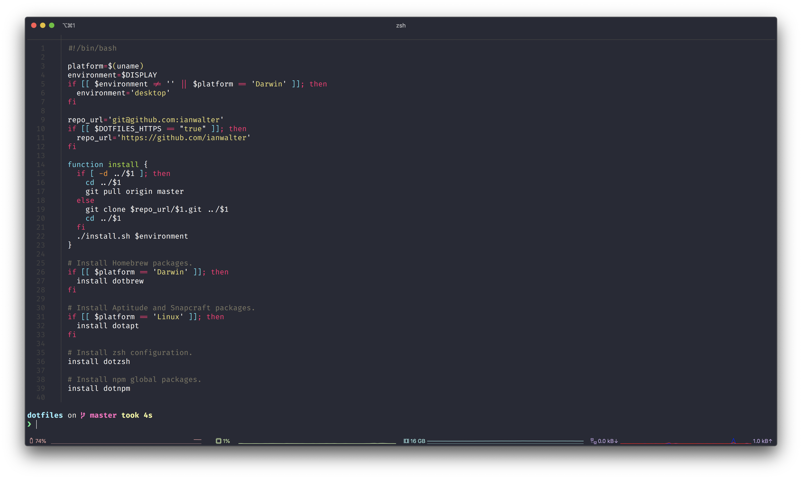

# dotiterm
> Ian's [iTerm2][itermUrl] configuration (part of [dotfiles][dotfilesUrl])



## Installation

```console
./install.sh
```

## License

Apache 2.0 with Commons Clause - See [LICENSE][licenseUrl]

&nbsp;

Created by [Ian Walter](https://iankwalter.com)

[itermUrl]: http://www.iterm2.com
[dotfilesUrl]: https://github.com/ianwalter/dotfiles
[licenseUrl]: https://github.com/ianwalter/dotiterm/blob/master/LICENSE
